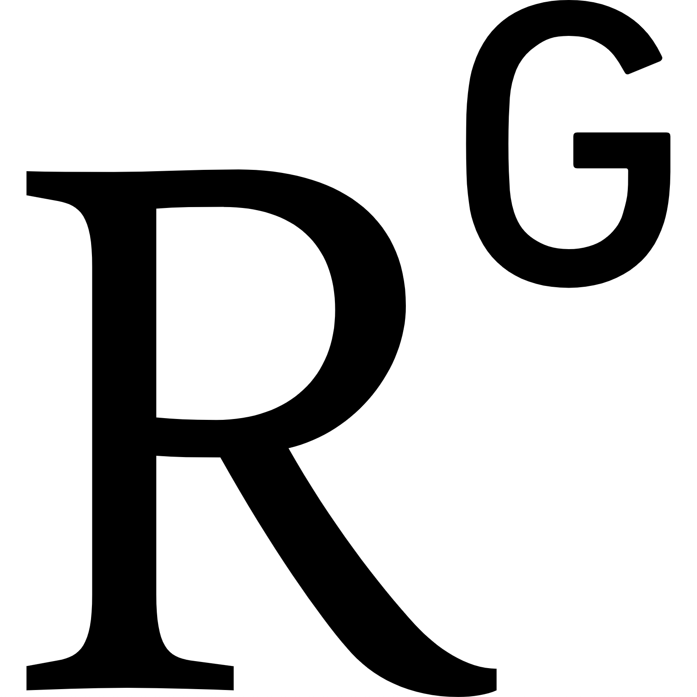

### [Home](index.md)

# Pubblications
He has co-authored some papers to international conferences and to important journals for the sector of Remote Sensing. 

####  [Google Scholar](https://scholar.google.com/citations?hl=it&user=WoTTS-UAAAAJ) [Research Gate](https://www.researchgate.net/profile/Alessandro-Sebastianelli) [Orcid](https://orcid.org/0000-0002-9252-907X)

He is also a co-Editor of a book entitled "Artificial Intelligence Applied to Satellite-based Remote Sensing Data for Earth Observation” available on [the IET](https://shop.theiet.org/artificial-intelligence-applied-to-satellite-based-remote-sensing-data-for-earth-observation).

## 2021
- Zaidenberg, D. A., Sebastianelli, A., Spiller, D., Saux, B. L., & Ullo, S. L. (2021). Advantages and Bottlenecks of Quantum Machine Learning for Remote Sensing. arXiv preprint arXiv:2101.10657.
- Sebastianelli, A., Del Rosso, M. P., & Ullo, S. L. (2020). Automatic Dataset Builder for Machine Learning Applications to Satellite Imagery. arXiv preprint arXiv:2008.01578.
- Sebastianelli, A., Mauro, F., Di Cosmo, G., Passarini, F., Carminati, M., & Ullo, S. L. (2021). AIRSENSE-TO-ACT: A Concept Paper for COVID-19 Countermeasures Based on Artificial Intelligence Algorithms and Multi-Source Data Processing. ISPRS International Journal of Geo-Information, 10(1), 34.
- S. L. Ullo and A. Mohan and A. Sebastianelli and S. E. Ahamed and B. Kumar and R. Dwivedi and G. R. Sinha, "A New Mask R-CNN Based Method for Improved Landslide Detection," in IEEE Journal of Selected Topics in Applied Earth Observations and Remote Sensing, doi: 10.1109/JSTARS.2021.3064981.

## 2020
- De Corso, T., Mignone, L., Sebastianelli, A., Del Rosso, M. P., Yost, C., Ciampa, E., ... & Sica, S. (2020). Application of DInSAR Technique to High Coherence Satellite Images for Strategic Infrastructure Monitoring. In IEEE International Geoscience and Remote Sensing Symposium, IGARSS 2020. Institute of Electrical and Electronics Engineers Inc..

## 2019
- Ullo, S. L., Langenkamp, M. S., Oikarinen, T. P., DelRosso, M. P., Sebastianelli, A., & Sica, S. (2019, July). Landslide geohazard assessment with convolutional neural networks using sentinel-2 imagery data. In IGARSS 2019-2019 IEEE International Geoscience and Remote Sensing Symposium (pp. 9646-9649). IEEE.

## 2018
- Ullo, S. L., Angelino, C. V., Cicala, L., Fiscante, N., & Addabbo, P. (2018, July). Use of Differential Interferometry on Sentinel-L Images for the Measurement of Ground Displacements. Ischia Earthquake and Comparison with Ingv Data. In IGARSS 2018-2018 IEEE International Geoscience and Remote Sensing Symposium (pp. 2216-2219). IEEE.
- Ullo, S. L., Mohan, A., Sebastianelli, A., Ahamed, S. E., Kumar, B., Dwivedi, R., & Sinha, G. R. (2020). A New Mask R-CNN Based Method for Improved Landslide Detection. arXiv preprint arXiv:2010.01499.
